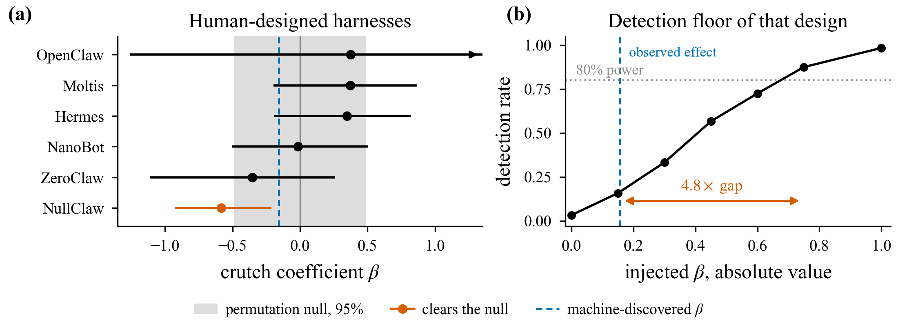

# Do self-generated agent improvements survive a change of base model?

Code and analysis for measuring whether a machine-discovered agent harness compensates for the model that found it.

**Erfan Darzi**

[Findings](analysis/FINDINGS.md) · [Working note](paper/note.md) · [Preregistration](experiments/ablation/PREREGISTRATION.md)

<p align="center">
  
</p>

<p align="center">
<sub><b>(a)</b> Crutch coefficients for six human-designed harnesses (Harness-Bench: 5,194 runs,
8 models × 103 tasks). Points are split-half estimates, intervals bootstrap 95% CIs over tasks,
arrows mark intervals running past the axis. Only NullClaw clears its permutation null.
<b>(b)</b> Detection rate of that same design against gradients injected at known size, starting
from relabelled cubes so the target carries no gradient of its own. Power reaches 80% only at
|β| ≈ 0.75, against a published machine-discovered effect of |β| = 0.156.</sub>
</p>

A search loop that scores candidates on one fixed model cannot tell a *compensatory* patch from a *systemic* one. Both raise the same number at discovery time. The distinction is whether the gain shrinks as the base model improves. We call the slope of that relationship the **crutch coefficient**: negative means the modification is worth less on stronger models; flat means it is not.

The public record is not large enough to estimate that slope for a discovered harness. Meta-Harness Table 6 gives five held-out models and a point estimate of β = −0.156 (r = −0.577, p = 0.31). The largest published harness × model matrix (Harness-Bench: 6 harnesses × 8 models × 103 tasks) reaches 80% power only at |β| ≈ 0.75, 4.8× that effect. Five of six human-designed harnesses show no gradient, and the signs flip with the scoring metric. The binding constraint is the eight-model ladder, not the tasks under it.

The experiment that can tell is therefore a within-harness ablation of one released artifact, preregistered in [`experiments/ablation/`](experiments/ablation/) before any spend. The artifact itself is 94.0% token-identical to its parent; the semantic delta is environment bootstrapping plus 35 tokens.

## Setup

```bash
git clone https://github.com/Erfandarzi/rsi-transfer.git
cd rsi-transfer
pip install -e ".[dev]"
```

| Command | What it does |
|---|---|
| `make data` | Fetch the published Harness-Bench run matrix into `data/raw/` (not redistributed here) |
| `make figures` | Regenerate every figure from cached data. No network, no API keys |
| `make test` | Estimator, metric, and ablation-arm integrity |
| `make arms` | Pin upstreams and build the five ablation arms |
| `make anatomy` | Token-level diff of the artifact against its parent |
| `python experiments/ablation/cost_estimate.py` | Projected spend for the run matrix (≈ $279). Prints; does not run anything |

```bash
python analysis/01_pilot_table6.py     # Meta-Harness Table 6, five held-out models
make anatomy                           # token identity and the hardcoded /app/ listing
python analysis/02_reference_class.py  # split-half estimator on Harness-Bench
python analysis/03_power_floor.py      # injected-gradient power
```

Advantage and capability are computed on disjoint halves of the remaining harnesses and averaged over random splits. Every slope is quoted against a permutation null that shuffles harness labels within each (model, task) cell. That null centres on −0.0001.

## Experiment

Three mechanisms from one released Terminal-Bench 2 harness, isolated as separate arms, each with a prediction committed in [`experiments/ablation/PREREGISTRATION.md`](experiments/ablation/PREREGISTRATION.md):

| Arm | Mechanism | Prediction |
|---|---|---|
| `no_bootstrap` | environment snapshot injected into the first prompt | β < 0 |
| `no_haiku_json` | decode commands when the model double-encodes them | β < 0, near-binary in model family |
| `no_cancelled` | treat `asyncio.CancelledError` as retryable | β ≈ 0 (control) |

If the control shows a gradient, the instrument is measuring something other than compensation and the other two readings are void. Primary outcomes are turns and tokens rather than pass rate: the artifact's claim is that it saves 2–5 early exploration turns.

The matrix, ladder, tasks, and attempts are fixed in `experiments/ablation/matrix.yaml`. Upstreams are fetched at commits in `upstream.lock`; nothing is vendored.

## Citation

```bibtex
@software{darzi2026rsitransfer,
  author = {Darzi, Erfan},
  title  = {rsi-transfer: measuring whether self-generated agent improvements
            survive a change of base model},
  year   = {2026},
  url    = {https://github.com/Erfandarzi/rsi-transfer}
}
```

## Acknowledgements

This work analyses artifacts released by others. Upstreams are fetched at pinned commits rather than vendored.

- [Meta-Harness](https://arxiv.org/abs/2603.28052) (Lee, Nair, Zhang, Lee, Khattab, Finn) — the discovered harness under study, and the held-out evaluation that motivates the Table 6 reanalysis. Their Terminal-Bench 2 result had no held-out split because the benchmark was too expensive; this work follows that thread.
- [Terminus-KIRA](https://github.com/krafton-ai/KIRA) (KRAFTON AI) — the parent agent, which makes a clean ablation possible with no reimplementation.
- [Harness-Bench](https://arxiv.org/abs/2605.27922) (Qihoo360) — 5,194 published runs across 7 harnesses and 8 models.
- [Harbor](https://github.com/harbor-framework/terminal-bench) — the runner.

Related work on a different durability axis: [AgingBench](https://agingbench.github.io/) and *Your Agents Are Aging Too* ([arXiv:2605.26302](https://arxiv.org/html/2605.26302)) measure how human-designed memory policies degrade over deployment sessions with frozen weights.

## License

MIT ([LICENSE](LICENSE)). Harness-Bench publishes no licence file, so its run data is all-rights-reserved by default: cached locally, cited, never redistributed. `data/raw/` is gitignored; `make data` fetches from the authors' site.

[](https://github.com/Erfandarzi/rsi-transfer/actions/workflows/ci.yml)
[](LICENSE)
